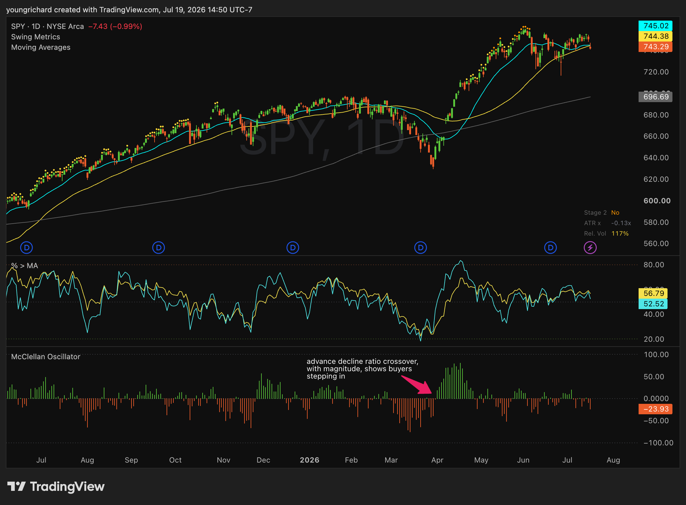

# TradingView Indicators for swing trading

Custom indicators to assist with situational awareness, and determining swing trading environment.
Credits to @jfsrev for `swing_metrics`, and @lazybear, @danarm for `mcclellan_oscillator`

In combination, the indicators help read the market top-down: trend, participation, then flow.

## How to read it (top-down)

| Pane | Question | Indicator(s) |
|---|---|---|
| **1. Trend** | Are we in an uptrend, and is it healthy or stalling? | SPY price + `swing_mas` + `swing_metrics` (ATR-x) |
| **2. Participation** | How many stocks are in uptrends? | `breadth_pct_above_ma` (% > MA) |
| **3. Flow** | Are buyers in control today? Will breakouts follow through? | `mcclellan_oscillator` |

In theory, breakouts have greater probabilities of success in an uptrend, and positive flow, _and_ the market is not extended.

## The indicators

### Swing Metrics — `swing_metrics.pine` (overlay)
ATR-extension dots above price + metrics table.
- **ATR-extension dots**: yellow (4x) getting extended, reduce new entries;
  orange (7x) warning, tighten stops; red (10x) take-profit zone.
- **Table (ATR-x, Stage 2, Rel. Vol, RS, LoD, 52W…)**: values highlight only
  when they cross a threshold worth noticing.
- Credit: [@jfsrev](https://twitter.com/jfsrev) for the ATR-extension concept, and original indicator.

### Breadth: % of Stocks Above MA — `breadth_pct_above_ma.pine` (pane)
Plots MMFI (% of stocks above their **50-day** MA, slow) and optional MMTW
(20-day, fast). Read as a **percent (0–100)**.
- **~80 = overbought**, **~20 = oversold**, **50 = the dividing line**.
- The signal is at *turns*: the fast line crossing **under** the slow = early
  participation softening; crossing back **over** = pressure returning.

### McClellan Oscillator — `mcclellan_oscillator.pine` (pane)
- **Above zero** = breadth momentum positive (buyers). **Below zero** = negative
  (sellers). **Distance from zero** = thrust strength.
- The ± extreme lines mark an unusually strong thrust. A positive extreme is often a *bullish thrust*; the actionable signal is the thrust **rolling over**.

## What to look at in the screenshot

- **ATR-x readout** (Swing Metrics table) — how stretched from the 50-MA;
- **Extension dots** above the bars — yellow → orange → red as the move stretches.
- **Stage 2 flag** — is this a clean uptrend, or (as now) `No` = consolidating.
- **Breadth 50-line** — which side of the participation divide you're on.
- **Breadth 80 / 20 zones** — overbought vs oversold.
- **McClellan zero line** — buyers vs sellers (flow).

## Setup

For each indicator: TradingView → **Pine Editor** → paste the `.pine` file →
**Add to chart**. Put `swing_metrics` on the SPY price pane;
add `breadth_pct_above_ma` and `mcclellan_oscillator` as their own panes below.

## License

MPL 2.0. Based on @jfsrev @LazyBear and @danarm community scripts.
