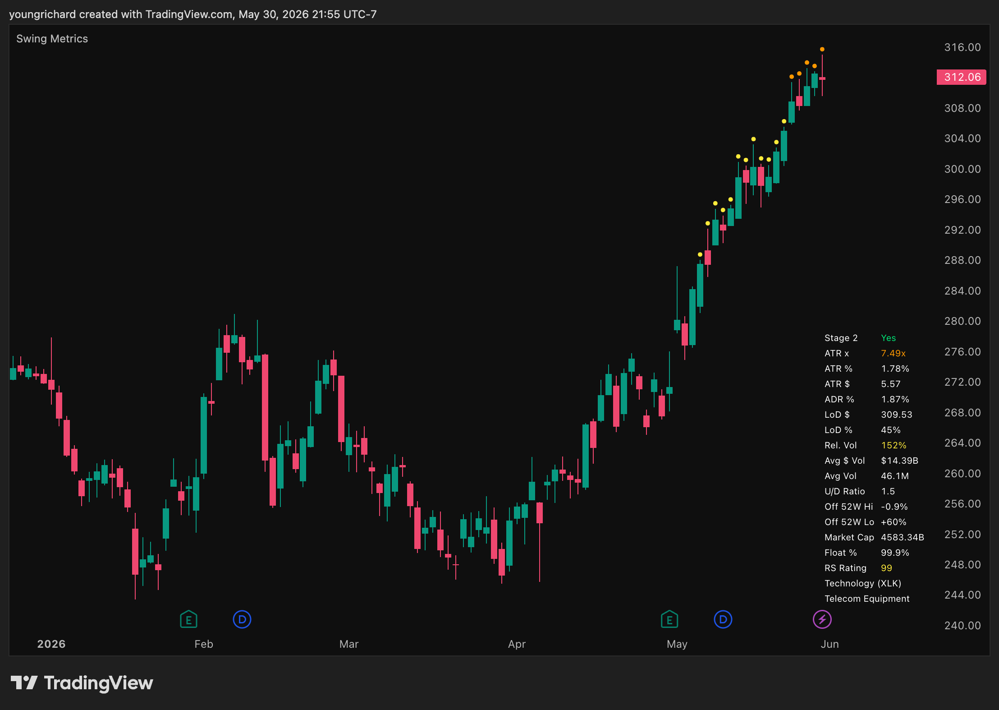

# Swing Metrics

A TradingView indicator for swing traders that combines ATR extension tracking with key metrics in a configurable table overlay.

## What it does

**ATR Extension Dots** appear above price bars when the stock is extended beyond its moving average, measured in ATR multiples. Dots change color as extension increases:

- **Yellow** (4x ATR) - Getting extended, avoid new entries
- **Orange** (7x ATR) - Danger zone, tighten stops
- **Red** (10x ATR) - Take profit zone

**Metrics Table** displays at-a-glance data in a corner of the chart. Values highlight yellow only when they cross a threshold worth paying attention to - otherwise they stay white.

## Metrics

| Metric | Description | Highlights yellow when |
|--------|-------------|----------------------|
| Stage 2 | Price > 50 SMA > 200 SMA, 50 SMA rising | Green if yes, orange if no |
| ATR x | ATR multiples extended from MA | Matches dot color |
| ATR % | ATR as percentage of price | > 4% |
| ATR $ | ATR in dollars | - |
| ADR % | Average day range as percentage | > 4% |
| LoD $ | Low of day price | - |
| LoD % | Distance from low of day (in ATR) | > 60% |
| Rel. Vol | Volume relative to 50-day average | > 100% |
| Off 52W Hi | Distance from 52-week high | - |
| RS Rating | Relative strength vs S&P 500 | > 90 |
| Sector / Industry | Sector ETF mapping and industry | - |

Additional fields available (hidden by default): Off 52W Low, Avg $ Vol, Avg Vol, U/D Ratio, Market Cap, Float %.

## Setup

1. In TradingView, open the Pine Editor
2. Paste the contents of `swing_metrics.pine`
3. Click **Add to chart**

## Configuration

Settings are organized into four groups:

**1. Table Settings** - Position, size, and colors.

**2. Parameters** - MA type/length, ATR length, volume MA length. Defaults (SMA 50, ATR 14, Vol MA 50) work well for daily swing trading.

**3. Chart Visuals** - Extension dot appearance and ATR threshold levels.

**4. Field Order** - Control which metrics appear and in what order. Set a field to `0` to hide it. Lower numbers appear higher in the table.

## Notes

- ATR extension dots and several metrics only display on daily charts (thresholds are calibrated for daily)
- Sector and industry fields are hidden for ETFs
- Credits to [@jfsrev](https://twitter.com/jfsrev) for the original ATR extension concept
